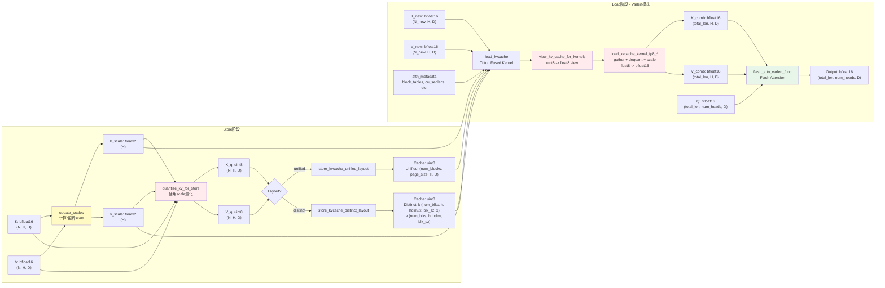

# Diffulex 量化模块架构图

## 完整架构图

## 数据流图

## 策略选择流程图

## Linear量化决策流程图

## KV Cache量化流程图

### 完整KV Cache量化流程（包含Store和Load）

### 数据类型传递详细图

### Layout和Decode模式决策树

### 详细数据流图：Unified Layout Static模式（FP8）

### 详细数据流图：Varlen模式（FP8，Unified/Distinct Layout）

### 关键数据类型转换总结表

| 阶段 | 操作 | 输入类型 | 输出类型 | 说明 |
|------|------|---------|---------|------|
| **Store (BF16)** | 直接存储 | `bfloat16 [N, H, D]` | `bfloat16 [num_blocks, page_size, H, D]` | 无需量化，直接存储 |
| **Store (FP8)** | quantize_kv_for_store | `bfloat16 [N, H, D]` + `float32 [H]` scale | `uint8 [N, H, D]` | 量化并存储为uint8 |
| **Store (FP8)** | 存储到cache | `uint8 [N, H, D]` | `uint8 [num_blocks, page_size, H, D]` | 存储为uint8格式 |
| **Load (Static FP8)** | view_kv_cache_for_kernels | `uint8 [num_blocks, page_size, H, D]` | `float8 view [num_blocks, page_size, H, D]` | 视图转换，不改变存储 |
| **Load (Static FP8)** | TileLang Kernel | `float8 view` + `float32 [H]` scale | `bfloat16 [num_seqs, num_heads, D]` | Kernel内反量化+scale |
| **Load (Varlen FP8)** | view_kv_cache_for_kernels | `uint8 [num_blocks, page_size, H, D]` | `float8 view [num_blocks, page_size, H, D]` | 视图转换 |
| **Load (Varlen FP8)** | Triton Fused Kernel | `float8 view` + `float32 [H]` scale | `bfloat16 [total_len, H, D]` | gather + dequant + scale |
| **Attention** | flash_attn_varlen_func | `bfloat16 [total_len, num_heads, D]` | `bfloat16 [total_len, num_heads, D]` | Flash Attention计算 |

### 路径选择决策表

| Layout | Decode Mode | 量化格式 | Store Kernel | Load Kernel | Attention Kernel |
|--------|-------------|---------|--------------|-------------|------------------|
| Unified | static | bf16 | `store_kvcache_unified_layout` → BF16 kernel | 无（直接使用cache） | `dllm_flash_attn_decode_kernel` (TileLang) |
| Unified | static | fp8 | `store_kvcache_unified_layout` → FP8 kernel | `view_kv_cache_for_kernels` | `dllm_flash_attn_decode_kernel_bf16_q_fp8_kv` (TileLang) |
| Unified | varlen | bf16 | `store_kvcache_unified_layout` → BF16 kernel | `load_kvcache_bf16` (Triton) | `flash_attn_varlen_func` |
| Unified | varlen | fp8 | `store_kvcache_unified_layout` → FP8 kernel | `load_kvcache_fp8` (Triton fused) | `flash_attn_varlen_func` |
| Distinct | varlen | bf16 | `store_kvcache_distinct_layout` → BF16 kernel | `load_kvcache_bf16` (Triton) | `flash_attn_varlen_func` |
| Distinct | varlen | fp8 | `store_kvcache_distinct_layout` → FP8 kernel | `load_kvcache_fp8` (Triton fused) | `flash_attn_varlen_func` |

**注意**：
- Distinct layout **总是**使用varlen模式（因为K的split layout不适合static模式）
- Static模式**仅支持**Unified layout
- FP8量化在static模式下，反量化在TileLang kernel内部完成
- FP8量化在varlen模式下，反量化在`load_kvcache`的Triton fused kernel中完成
